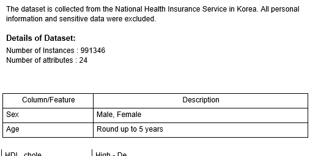
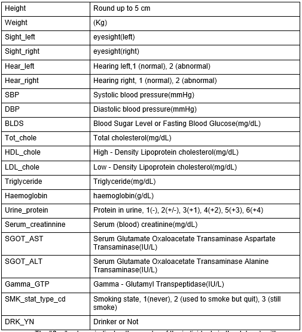
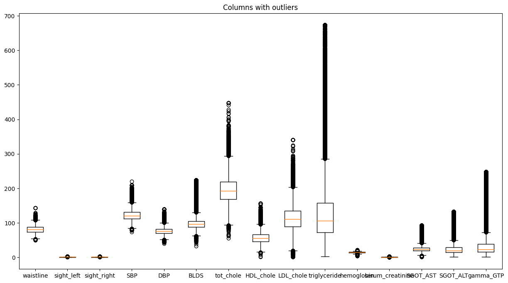
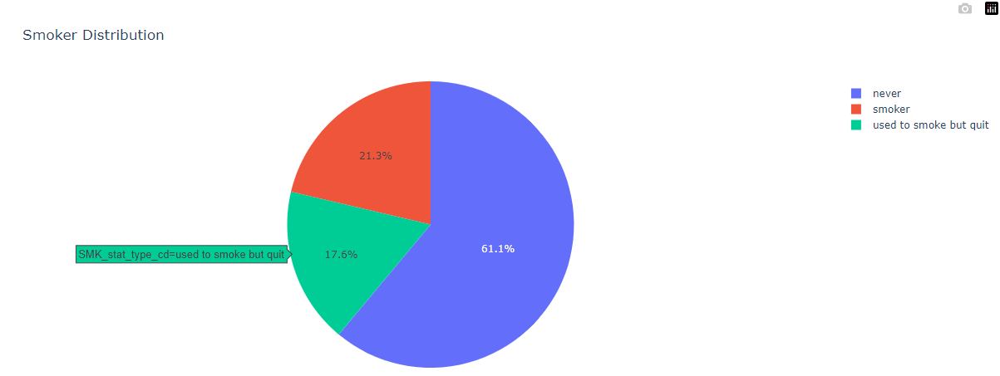
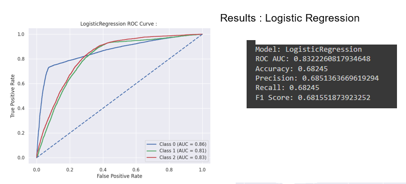
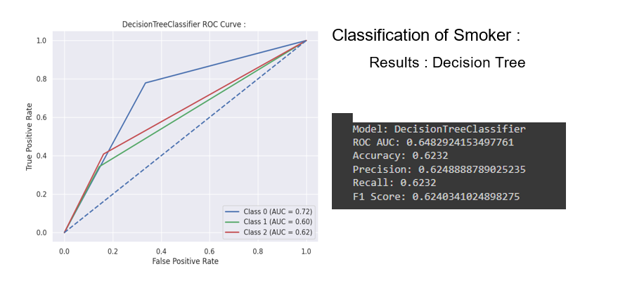

# Classification of Smoker
(NOTE : This is just an overview, for full report check ProjectReport.rtf in the repo.)

Aim : On the basis of vitals of the body or on the basis of body signals, the model will classify whether a person is a smoker or not. 
The dataset is collected from the National Health Insurance Service in Korea. All personal information and sensitive data were excluded.

## Dataset

There are 6 categorical and 18 numerical variables in our dataset. We'll encode the categorial values with numerical values.

## EDA

Winsorization can be performed on the attributes which have outliers.

Smoker is a 3 class attribute.

## Results

